# Disease Prediction Using Machine Learning 

## Members
### Cohort: 8, Team: ML06
- [Aakash Bajaj](https://github.com/aakash11bajaj)
- [Amena Muzaffar Shumi](https://github.com/amena2712-del)
- [Deeqa Mahamed](https://github.com/deeqa-s)
- [Ecce Djogbenou Epse Houenou](https://github.com/eccehouenou)
- [Emre Ozkan]()
- [Haimeng (James) Wang](https://github.com/hmwang-ca)
---
# Contents 
- [Project Overview](#Project-Overview)  
- [Business Objective](#business-objective) 
    * [Business Question](#business-question)
    * [Stakeholders](#stakeholders)
- [Dataset](#Dataset) 
    * [Details](#Details) 
    * [Variables/Features](#Variables-/-Features)
    * [Target Variable](#target-variable)
- [Potential Risks and Uncertainty](#potential-risks-and-uncertainty) 
- [Methodology](#methodology) 
    * [Modeling Approach](#modeling-approach) 
    * [Technical Stack](#technical-stack)
- [Repository Structure](#repository-structure) 
- [Task Log](#task-log)
    * [Task Completed (Week 1)](#task-completed-week-1)
    * [Task Completed (Week 2)](#task-completed-week-2)
- [Exploratory Data Analysis](#exploratory-data-analysis)
- [Model Development and Evaluation](#model-development-and-evaluation)
    * [Model 1: Logistic Regression](#model-1-logistic-regression)
    * [Model 2: Decision Tree Model](#model-2-decision-tree-model)
    * [Model 3: Bernoulli Naive Bayes](#model-3-bernoulli-naive-bayes)
    * [Model 4: Random Forest](#model-4-random-forest)
    * [Model 5: XGBoost](#model-5-xgboost)
    * [Model 6: Hierarchical and KNN Clustering](#model-6-hierarchical-and-knn-clustering)
- [Model Comparisons](#model-comparisons)
- [Conclusions](#conclusions)
- [Future Directions](#future-directions)
- [Team Videos](#team-videos)
- [References](#references)

---
# Project Overview
This project applies **unsupervised and supervised machine learning methods to predict diseases based on a patient's reported symptoms.** \
The goal is to build a multi-class classifier that can identify which of 41 possible diseases a patient is most likely to have, based on the presence or absence of 132 distinct symptoms.

A key emphasis of this project is **model interpretability** i.e. understanding *which symptoms drive predictions* and *how confident the model is* in distinguishing between similar diseases with high **predictive accuracy**. 

This makes the project relevant to clinical decision support contexts, where explainability is just as important as performance.

---
# Business Objective
Delayed or incorrect diagnosis remains a critical challenge in healthcare, particularly in resource-limited settings where access to specialists and diagnostic tests is constrained. 

This project aims to **develop a machine learning-based symptom classifier** that can assist clinicians and healthcare workers in identifying the most probable disease from a patient's reported symptoms. 

By surfacing likely diagnoses early in the clinical encounter, the model has the potential to support
- faster triage 
- reduces reliance on broad-spectrum testing
- serves as a structured decision aid for less experienced medical staff 

The ultimate objective is to demonstrate how interpretable machine learning can add measurable value to frontline diagnostic workflows.

## Business Question

>  **Can we accurately predict a patient's disease from their reported symptoms?** 

>  **Which symptoms are most diagnostically informative to distinguish between diseases?**

### Sub-questions

1. Which machine learning models yield the highest classification accuracy on symptom-based prediction?
2. Which symptoms carry the most predictive power both globally and per disease?
3. Are there groups of diseases with similar symptom profiles that models frequently confuse?
4. Can we build an interpretable model that a clinician could plausibly trust and act on?

---
### Stakeholders

**Technical stakeholders:**
* Data scientists and ML engineers:
* Public health departments

**Institutional stakeholders:**
* Hospitals: may want to quickly identify and stratify disease risk based on symptoms
* Insurance companies: might want to identify disease type to manage claims or determine coverage
* Patients: quickly get an accurate diagnosis by searching for a few key symptoms to decide whether to seek medical treatment

---

# Dataset 
## Details 

| Property | Details |
|---|---|
| **Source** | [Kaggle – Disease Prediction Using Machine Learning](https://www.kaggle.com/datasets/kaushil268/disease-prediction-using-machine-learning/data) |
| **Author** | kaushil268 |
| **Files** | `Training.csv`, `Testing.csv` |
| **Total Columns** | 133 |
| **Feature Columns** | 132 (binary symptom indicators: 0 = absent, 1 = present) |
| **Target Column** | `prognosis` (disease label) |
| **Training Rows** | 4,920 |
| **Testing Rows**  | 42 |
| **Number of Disease Classes** | 41 |

##  Variables / Features 

The dataset contains 132 binary symptom features. Each recording if the symptom is present (1) or absent (0). 

Example include: `itching`, `skin_rash`, `nodal_skin_eruptions`, `continuous_sneezing`, `shivering`, `chills`, `joint_pain`, `stomach_pain`, `acidity`, `vomiting`, `fatigue`, `weight_gain`, `anxiety`, `cold_hands_and_feets`, `mood_swings`, `weight_loss`, `restlessness`, `lethargy`, `patches_in_throat`, `irregular_sugar_level`, and many others.

## Target Variable

The `prognosis` column within the dataset contains the disease labels and is our Target variable. Each row has one of 41 potential labels.

The 41 classes span infectious diseases (e.g., Typhoid, Dengue, Malaria), chronic conditions (e.g., Diabetes, Hypertension, Arthritis), skin disorders (e.g., Psoriasis, Fungal infection), and gastrointestinal/respiratory conditions.

## Identified Issues and Limitations

**1. Synthetic / Rule-Based Data**
The dataset does *not* appear to originate from real clinical records. Symptom-to-disease mappings seem algorithmically generated, likely lacking noise, ambiguity, and co-morbidities found in real patients. 

**2. Artificially Balanced Classes**
Each disease class likely has a uniform or near-uniform number of records. This does not reflect clinical reality of disease prevalence.

**3. Binary Encoding Loses Clinical Nuance**
All symptoms are encoded as binary 0/1 flags. 
Severity, duration, and interaction patterns are not being considered.

**4. No Patient Demographics**
There are no features for age, sex, geographic region, or medical history.

**5. High Dimensionality with Potentially Sparse Features**
With 132 binary features, many symptoms may be near-zero variance or irrelevant for most disease classes. Feature selection is necessary to avoid overfitting and to improve model interpretability.

**6. No Temporal Information**
Each row is an isolated symptom profile. Real diagnosis often depends on how symptoms evolve over time, which this dataset does not capture.

> **Due to the above, we believe that some models may achieve near-perfect accuracy in this environment while failing to generalize to real-world clinical settings.**

>**_Results should be interpreted accordingly._**

---
# Methodology 
## Modeling Approach

Since this dataset is likely near-perfectly separable (symptom combinations map cleanly to diseases in a rule-based way), most models will achieve high raw accuracy. 

The more meaningful question becomes: 

**Which model is most interpretable and clinically trustworthy?** 

>Our evaluation will therefore emphasize both performance *and* explainability.

###  Model Choices and their Advantages 

| Model | Key Advantage|
|---|---|
Logistic Regression| Simple, Fast, Easy to Implement |
Decision Tree | Visualizable and Easy to Communicate |
Bernoulli Naive Bayes | Most Appropriate for Binary Features |
Random Forest | Robust, Handles Binary Features Well |
XGBoost | High Interpretability, Strong performance |
K-Nearest Neighbors (KNN) & Hierarchical Clustering| Non Parametric Comparator, Highly Interpretable |

## Technical stack
- **scikit-learn**: Fit and evaluate supervised and unsupervised ML models
- **xgboost:** Fit & evaluate XGBoost models
- **pandas**: Load and explore the dataset
- **numpy**: Basic data manipulations
- **matplotlib**: Create visualizations

---
# Repository Structure

```
Disease_Prediction_With_ML/
│
├── data/
│   ├── processed
│   └── raw/
│       ├── Training.csv
│       └── Testing.csv
│
├── experiments/
│   ├── EDA_deeqa.ipynb
│   ├── Decision_Tree_Analysis.ipynb
│   └── hier_clustering_deeqa.ipynb
│
├── notebooks/
│   ├── Aakash_xgb_knn.ipynb
│   ├── All_Model_comparisons_together.ipynb
│   ├── EDA_model_data_training.ipynb
│   ├── EDA_Training_data.ipynb
│   ├── emre-knn-random-forest.ipynb
│   ├── Logistic-Random-Amena.ipynb
│   └── Naive_Bayes_James.ipynb
│
├── results/
│   ├── aakash_results/
│   ├── amena_results/
│   ├── comparison_results/
│   ├── Ecce_results/
│   ├── emre_results/
│   └── james_results/
│
├── SETUP.md
│
└── README.md
```
Brief Description of the folders: 
* **Data:** Contains the raw data. 
* **Experiments:** A folder containing ipython notebook for data exploration and experiments.
* **Notebooks:** A folder containing final results from every team member
* **Results:** Contains all images and results used in the README.md file
* **SETUP:** Contains virtual environment setup instructions
* **README:** This file!

---
# Task Log
## Task Completed (Week 1)
Selecting the problem statement and dataset: Whole team
Creating git repository: Deeqa
Data exploration: Amena, Deeqa, Ecce
Readme file: Aakash
git support: Emre
Data review and discussion: Whole team
Discussion on readme file and next steps: Aakash, Amena, Ecce, Emre

## Task Completed (Week 2)

**First half of week 2**
Each team member will explore and compare multiple models. They will prepare a report with model code, interpretation, visualizations, evaluations and comparison. 
We have listed the model choices below for each team member.
- Aakash Bajaj: XGBoost, K-Nearest Neighbors (KNN)
- Amena Muzaffar Shumi: Logistic Regression, Random Forest
- Deeqa Mahamed: Decision Tree, XGBoost
- Ecce Djogbenou Epse Houenou: Bernoulli Naive Bayes, Random Forest
- Emre Ozkan: Random Forest, K-Nearest Neighbors (KNN)
- Haimeng (James) Wang: Bernoulli Naive Bayes, Decision Tree

**Second half of week 2**
We have listed the model choices below for each team member.
- Aakash Bajaj: Updating README.md file with results
- Amena Muzaffar Shumi: Finalization of results and code
- Deeqa Mahamed: Git support and presentation for project showcase 
- Ecce Djogbenou Epse Houenou: Updating README.md file with results
- Emre Ozkan: Git support and result compilation 
- Haimeng (James) Wang: Finalization of results and code & presentation for project showcase 
---
# Exploratory data analysis
### Dataset Overview

- Both Training & Test dataset contains 1 target variable, `prognosis`  and 132 feature variables
- There are a total of 4920 observations in Training dataset
- There are a total of 42 observations in Test dataset
- Both have 132 features which are binary (0 = absence, 1 = presence)
- The target variable `prognosis` is categorical with 41 unique disease classes in both datasets
- There are no missing values in any variable
- There are 94 % of duplicates.
**Dataset Quality Summary**
<div align="center">

| Property | Value |
|---|---|
| Missing Values (Train) | 0 |
| Missing Values (Test) | 0 |
| Feature Unique Values | 0, 1 (binary) |
| Number of Disease Classes | 41 |
| Min Samples per Class | 120 |
| Max Samples per Class | 120 |
| Mean Samples per Class | 120.0 |
| Symptoms per Record (Min) | 3 |
| Symptoms per Record (Max) | 17 |
| Symptoms per Record (Mean) | 7.45 |
| Symptoms per Record (Median) | 6.0 |
| Mean Symptom Prevalence | 5.64% |
| Max Symptom Prevalence | 39.27% |

</div>

## Target Variable

- The Target variable `prognosis` column contains the disease labels. 
- The 41 classes span infectious diseases contains 120 observations each. 

**Class Balance for Target Variable**
<p align="center">

</p>

**Average Number of Symptoms per Patient**
<p align="center">

</p>

- Most individuals report between 3 and 6 symptoms, with fewer cases exhibiting a high symptom burden (>14 symptoms). 
- This suggests moderate variability in symptom presentation across patients.
- Symptoms such as fatigue,vomiting, high fever appear frequently across multiple diseases.

**Top 20 Reported Symptoms**
<p align="center">
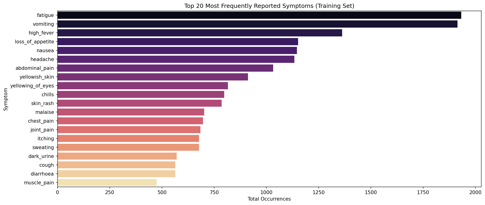
</p>

- Certain diseases show strong associations with specific symptoms, which may help machine learning models distinguish between conditions.

**Correlation Heatmap**
<p align="center">
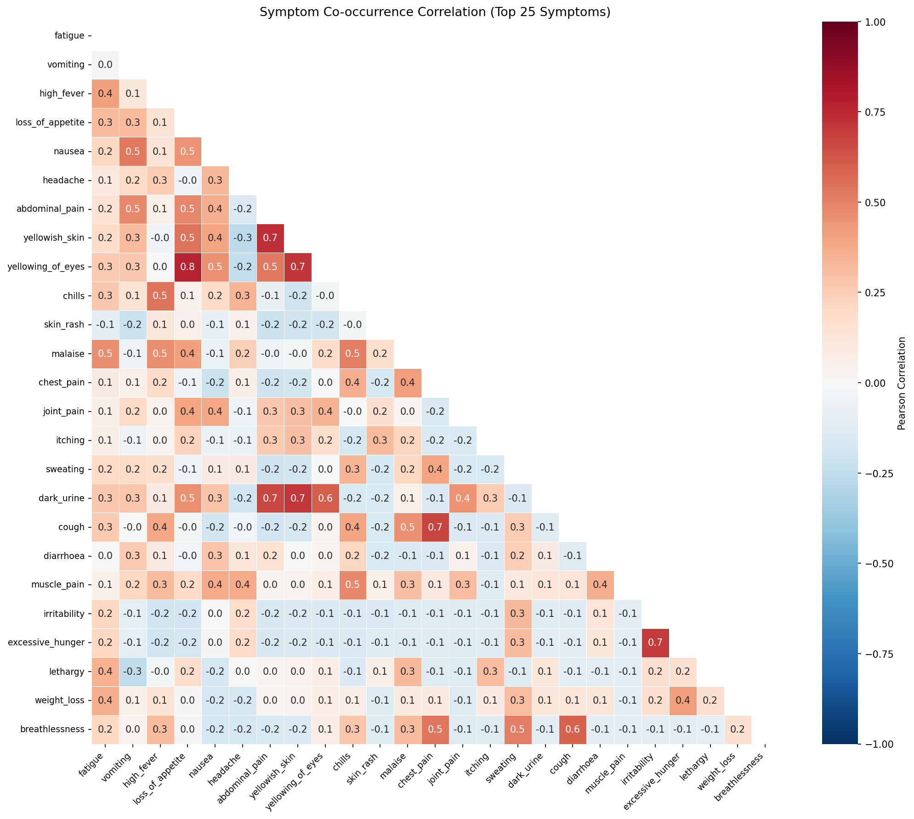
</p>

---
# Model Development and Evaluation

## Model 1: Logistic Regression
The first experiment involved training a Logistic Regression model, where the results were as follows:

**Results Table: Logistic Regression**
<div align="center">

| Metric                   | Value (Logistic Regression) |
| ------------------------ | ----- |
| Accuracy                 | 1.00  |
| Precision (Macro Avg)    | 1.00  |
| Recall (Macro Avg)       | 1.00  |
| F1 Score (Macro Avg)     | 1.00  |
| Precision (Weighted Avg) | 1.00  |
| Recall (Weighted Avg)    | 1.00  |
| F1 Score (Weighted Avg)  | 1.00  |
| Test Samples             | 42    |
| Number of Classes        | 42    |

</div>

### Logistic regression Visualizations

**Confusion Matrix - Logistic Regression**
<p align="center">

</p>

### Logistic Regression Strengths and Limitations

**Strengths:**
- The Logistic regression model is simple and interpretable  and help to understand how each symptom contributes to predictions. 
- It is Fast training and Works well with binary features. 
- It provides probabilities for each disease prediction. 
- It also has a low risk of overfitting.

**Limitations:**

- The Logistic regression model assumes linear relationships and may not capture complex interactions between symptoms. 
- It is sensitive to imbalanced data – biased toward diseases with more samples. 
- It performance depends on good preprocessing and feature selection. 
- With small dataset, there is high accuracy which may not generalize to larger or noisier datasets.

## Model 2: Decision Tree Model
The second experiment involved training a Decision Tree model, where the results were as follows: 

**Results Table: Decision Tree Model**
<div align="center">

| Metric | Value (Decision Tree) |
|---|---|
| 5-Fold CV Accuracy | 1.0000 ± 0.00 |
| Test Accuracy | **97.62%** |
| Misclassifications | 1 / 42 |
| Tree Depth | 55 |
| Number of Leaves | 69 |

</div>

### Decision Tree Model Visualizations

**Decision Tree - First 3 Levels**
<p align="center">
  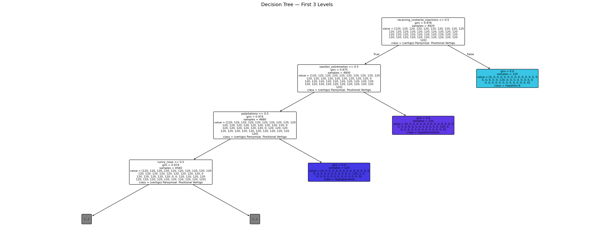
</p>

**Confusion Matrix - Decision Tree (Test Set)**
<p align="center">
  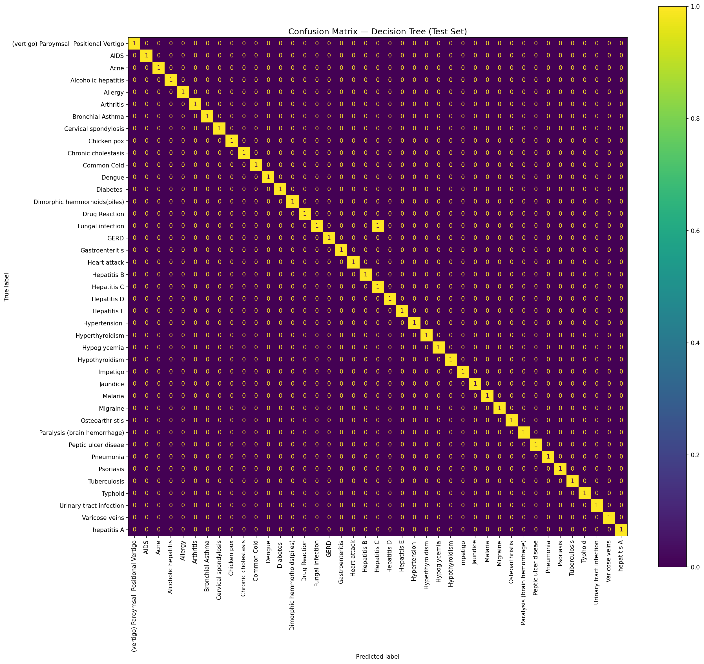
</p>

**Top 20 Feature Importance's — Decision Tree**
<p align="center">
  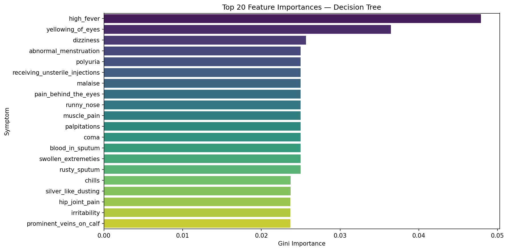
</p>

### Decision Tree Strengths and Limitations  

**Strengths:**
- Highly interpretable — decision rules are fully traceable from root to leaf.
- No feature independence assumption; handles correlated symptoms naturally.
- Feature importance clearly identifies `high_fever` and `yellowing_of_eyes` as the most discriminative symptoms.

**Limitations:**
- Very deep tree (depth = 55) indicates the model has memorized the training data — a hallmark of overfitting on this synthetic dataset.
- In real-world data, an unpruned tree this deep would generalize poorly. Pruning (`max_depth`, `min_samples_leaf`) or using an ensemble (Random Forest) would be advisable.
- The 1 misclassification (Fungal infection) suggests boundary cases exist where symptom overlap confuses the tree.

## Model 3: Bernoulli Naive Bayes
The third experiment involved training a Bernoulli Naive Bayes model, where the results were as follows:

**Results Table: Bernoulli Naive Bayes Model**

<div align="center">

| Metric |                 Score |
|--------|                -------|
| Accuracy |                1.00 |
| Precision (Macro Avg)    | 1.00 |
| Recall (Macro Avg)       | 1.00 |
| F1 Score (Macro Avg)     | 1.00 |
| Precision (Weighted Avg) | 1.00 |
| Recall (Weighted Avg)    | 1.00 |
| F1 Score (Weighted Avg)  | 1.00 |
| 5-Fold CV Accuracy | 1.0000 ± 0.0000 |
| Misclassifications | 0 / 42 |
</div>

### Bernoulli Naive Bayes Visualizations

**Confusion Matrix - Bernoulli Naive Bayes**

<p align="center">
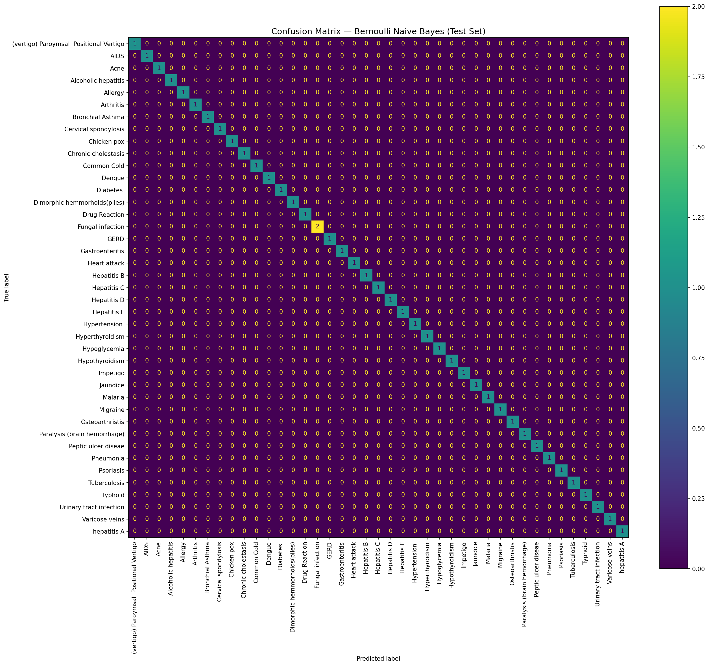
</p>

### Bernoulli Naive Bayes Strengths and Limitations

**Strengths:**
- Bernoulli Naive Bayes model works well with binary features. 
- It is computationally efficient, even with many features.
- It can manage datasets with many symptoms and provides class probabilities, useful for confidence assessment.
- It is simple and interpretable
- In our analysis, we had perfect accuracy on both cross-validation and the held-out test set.
- Fast to train and highly interpretable — each symptom's contribution can be read directly from the model's log-probabilities.

**Limitations:**

- Bernoulli Naive Bayes model assumes feature independence. 
- It cannot model interactions between symptoms and is sensitive to zero probabilities. 
- It may underperform with small datasets and probabilities can be skewed if there is few samples per class.
- Assumes conditional independence between features — violated by the 5 highly correlated symptom pairs identified in EDA (e.g. `yellowish_skin ↔ yellowing_of_eyes`).
- In real-world noisy data, this independence assumption would likely hurt performance. The perfect score here reflects the clean, synthetic nature of the dataset.
## Model 4: Random Forest
The fourth experiment involved training a Random Forest model, where the results were as follows:

**Results Table: Random Forest Model**

<div align="center">

| Metric |              Value (Random Forest) |
|--------|               -------|
| Accuracy |              0.976 |
| Precision (Macro Avg) | 0.99 |
| Recall (Macro Avg)     | 0.99 |
| F1 Score (Macro Avg)   | 0.98 |
| Precision (Weighted Avg) | 0.99 |
| Recall (Weighted Avg)    | 0.98 |
| F1 Score (Weighted Avg)  | 0.98 |
| Best Min Sample Split| 2 |
| Best Max Depth | None |
| Best Number of Estimators | 100 |
| Best CV Score | 1.0 |

</div>

### Random Forest Visualizations

**Confusion Matrix - Random Forest**

<p align="center">

</p>

**Top 30 Feature importance's — Random Forest**
<p align="center">

</p>
- With an accuracy of 0.97619; Muscle pain, itching, etc are the top features identified.

### Random Forest Strengths and Limitations

**Strengths:**
- Random forest captures complex, non-linear relationships and can handle symptom interactions automatically. 
- It handles high-dimensional data and  robust even with many features. It is resistant to overfitting. 
- It helps identify most predictive symptoms.

**Limitations:**

- Random Forest is less interpretable. 
- It is computationally heavier, slower training and more memory usage than simple models. 
- It is sensitive to imbalanced data. It requires setting random seeds for consistent results.
- Overfitting is possible with small data.

## Model 5: XGBoost
The fifth experiment involved training an XGBoost model, where the results were as follows:

**Results Table: XGBoost**

<div align="center">

| Metric | Value (XGBoost) |
|---|---|
| 5-Fold CV Accuracy<sup>*</sup>| 100% |
| Test Accuracy | **97.62%** |
| Test Precision | **98.78%** |
| Best Learning Rate| 0.05 |
| Best Max Depth | 3 |
| Best Number of Estimators | 50 |
<sup>*</sup> Fitting 5 folds for each of 27 candidates, totalling 135 fits.

</div>

### XGBoost Visualizations

**Confusion Matrix - XGBoost**
<p align="center">
  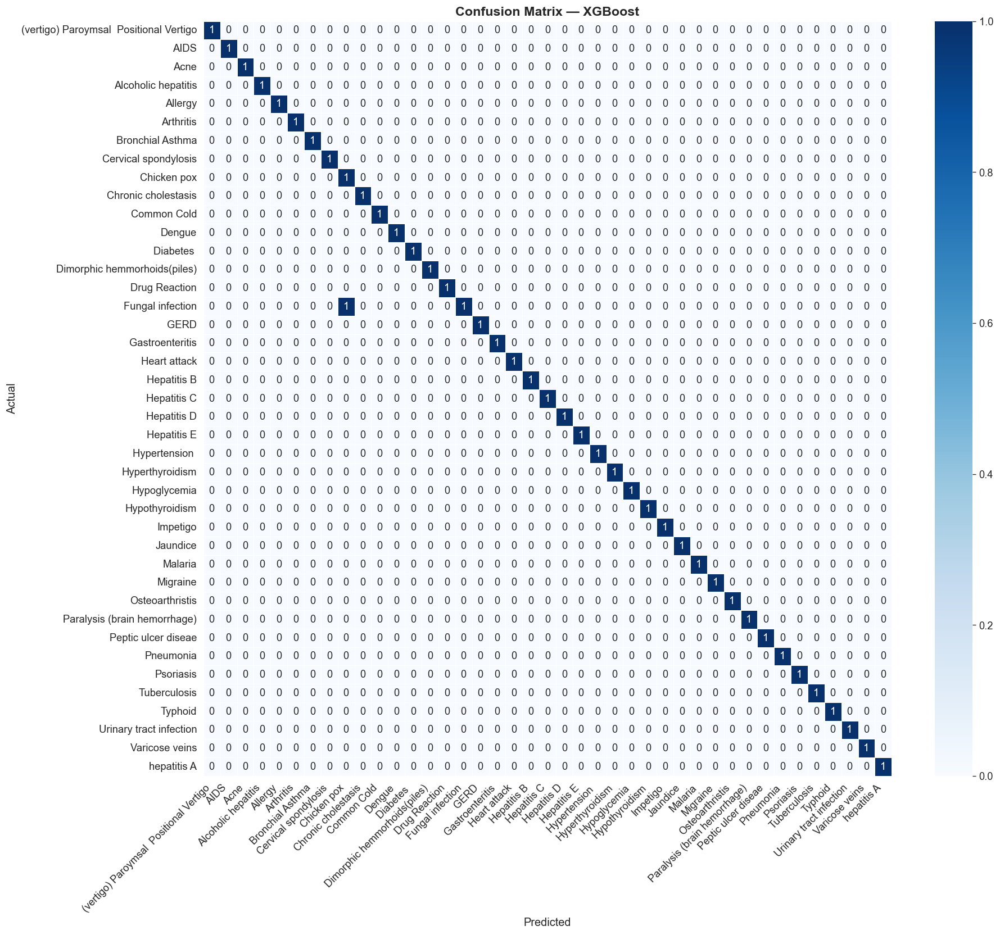
</p>

**Top 20 Feature importance's — XGBoost**
<p align="center">
  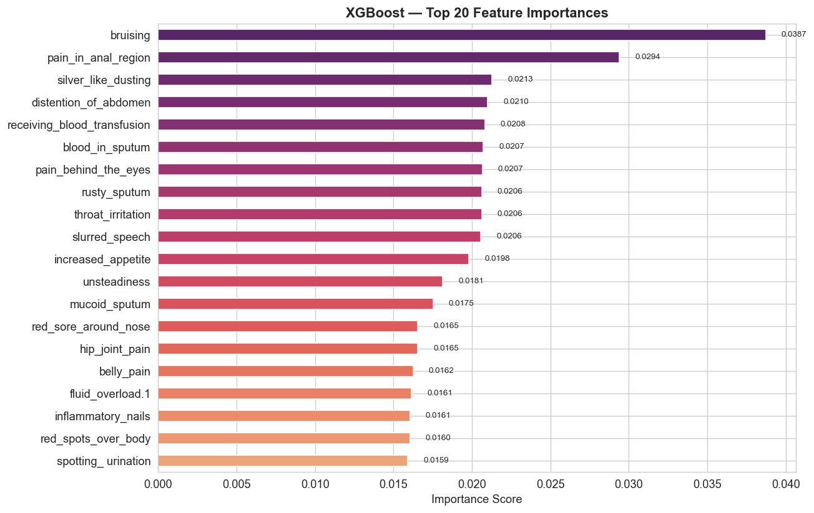
</p>

**SHAP Analysis — XGBoost**
<p align="center">
  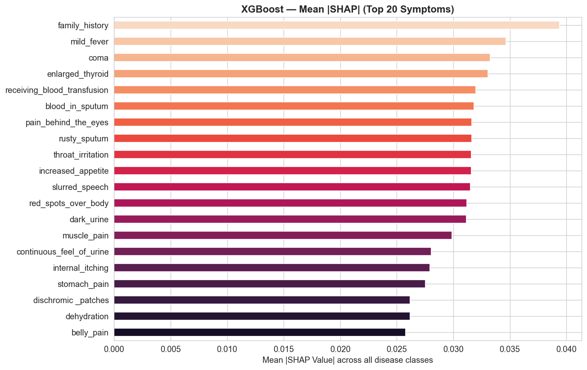
</p>

### XGBoost Strengths and Limitations  

**Strengths:**
- XGBoost demonstrated strong and consistent performance on this dataset indicating a highly stable and reliable model. 
- On the held-out test set it achieved high accuracy (97.62% ), correctly classifying 41 out of 42 disease cases. 
- The grid search revealed a remarkably shallow but optimal configuration (max_depth=3, n_estimators=50, learning_rate=0.05), suggesting it did not require aggressive complexity to learn the underlying symptom-disease relationships. 
- This model is very  explainable as it provides native feature importance scores and supports SHAP-based interpretability. 
- The SHAP analysis identified the specific symptoms (`family_history` and `mild_fever`) with highest diagnostic impact across all 42 disease classes.

**Limitations:**
- XGBoost model did not achieve perfect test set accuracy, misclassifying 1 out of 42 test cases (97.62%). 
- The model's boosting mechanism may have introduced a marginal degree of overfitting relative to simpler models.
- It also had the longest training time at 5.991 seconds, making it a lot slower than other models for no gain in test accuracy. 

## Model 6: Hierarchical and KNN Clustering
The sixth experiment involved training two clustering algorithms -  Hierarchical Clustering (Unsupervised) and KNN Clustering (Supervised)

### Hierarchical Clustering
For investigating natural clusters in the data, the *Jaccard distance* measure was used as it can accommodate binary features.

**Hierarchical Clustering - Dendrogram**
<p align="center">
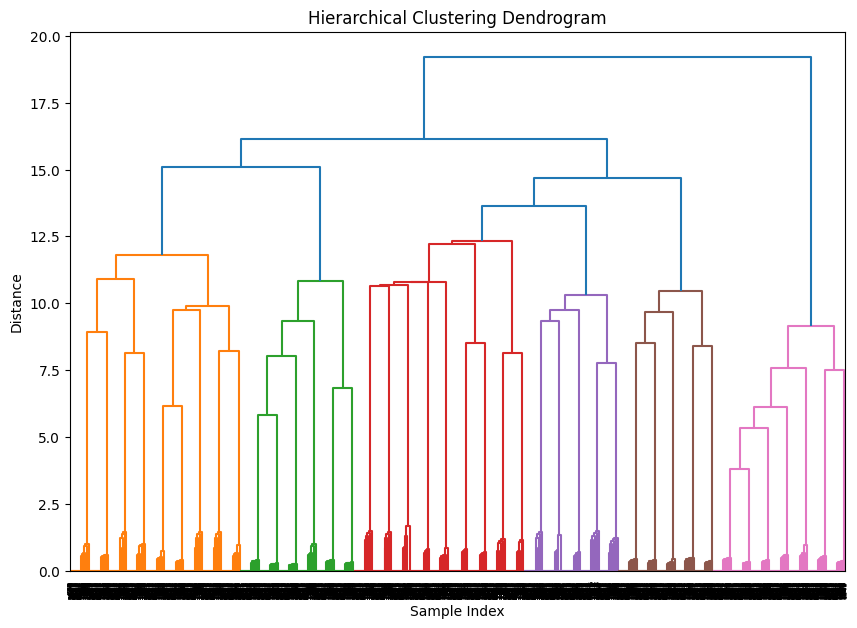
</p>
- There appear to be ~41 'natural' clusters in the data set that even split into a roughly equal number of observations, matching the number of diseases.

- The *Agglomerative Hierarchical Clustering* model was fit and had an accuracy of **100%**.

**Hierarchical Clustering - Prognosis Cluster Heat Map**
<p align="center">
  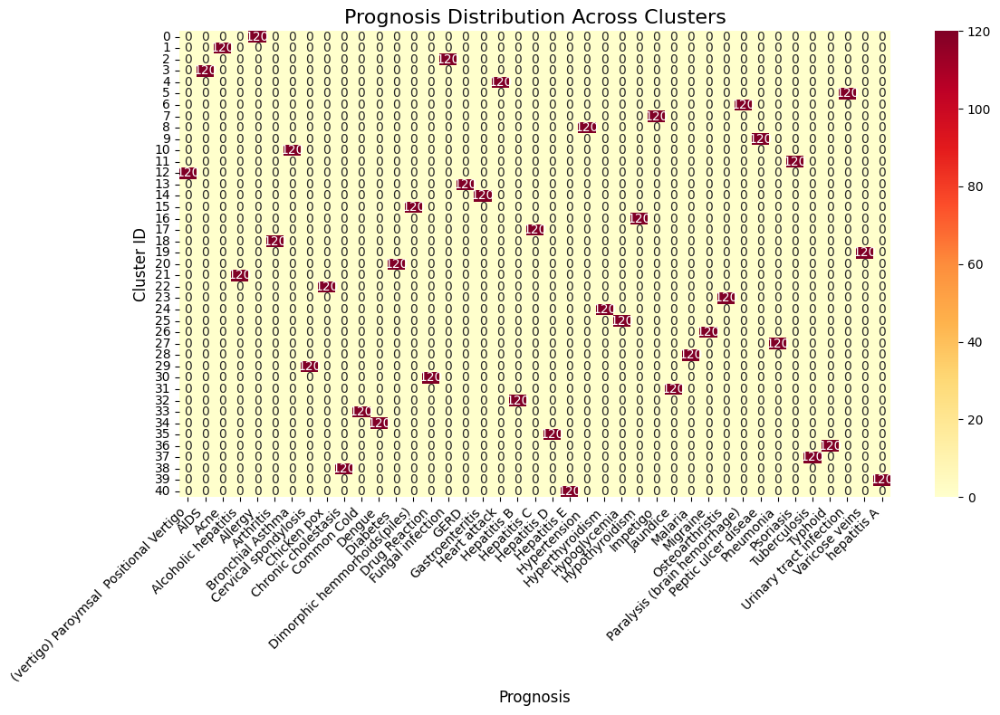
</p>

### KNN Clustering
The results for KNN Clustering were as follows:

**Results Table: KNN**

<div align="center">

| Metric | Value (KNN) |
|---|---|
| 5-Fold CV Accuracy| 100% |
| Test Accuracy | **100%** |
| Test Precision | **100%** |
| Best k| 1 |
| Best k Accuracy | **100%**  |

</div>

### KNN Visualizations

**Confusion Matrix - KNN (k = 5)**
<p align="center">
  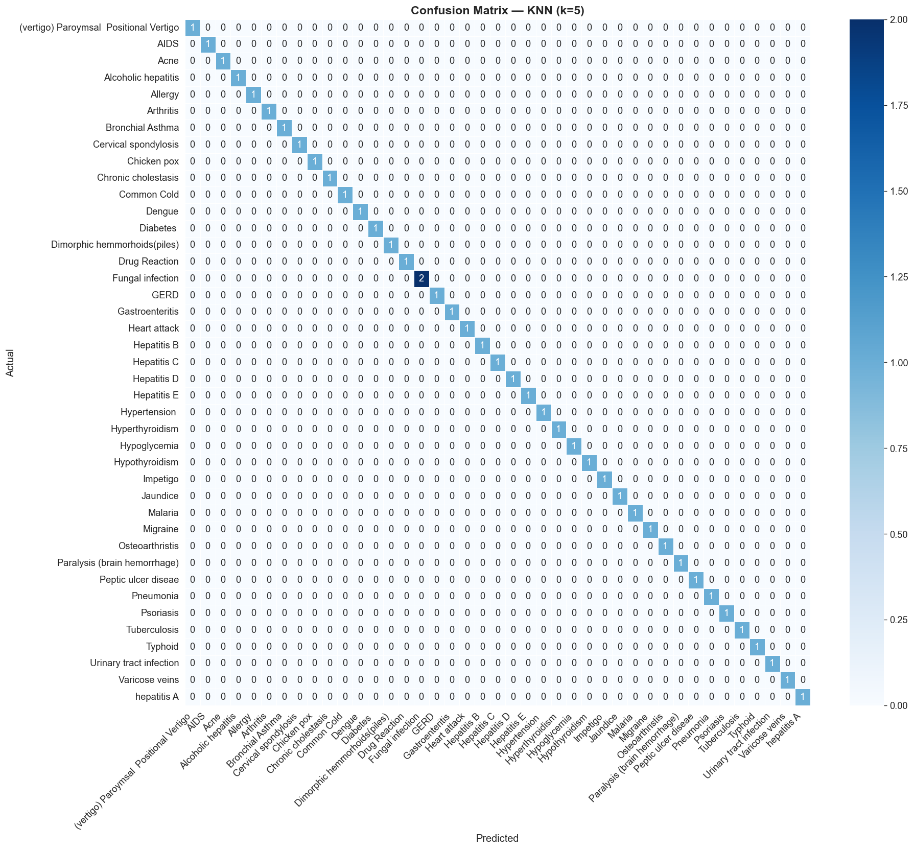
</p>

**KNN — Macro F1 vs K**
<p align="center">
  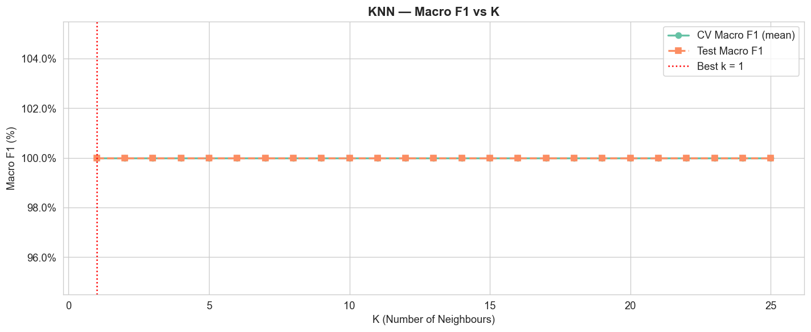
</p>


### Hierarchical Clustering & KNN Strengths and Limitations    

**Strengths:**
- Both methods are grounded in the same fundamental principle: distance between symptom profiles -
  - KNN uses distance to classify individual patients. 
  - Hierarchical clustering uses distance to reveal the broader structure of disease relationships in symptom space.
  - KNN works perfectly here because the diseases are genuinely distinct, and Hierarchical Clustering shows why and where that distinctiveness exists.
  - Both models were also very fast for *this* dataset.
- *Hierarchical Clustering*
  - The dendrogram revealed that most diseases occupy distinct regions in symptom space, with branch merge heights that confirm low inter-class similarity. 
  - The clustered heatmap further showed that disease groups share coherent symptom signatures.
- *KNN* 
  - Achieved perfect scores (100%) across accuracy, Macro F1, Precision and Recall on both CV and test set
  - Completely robust to hyperparameter choice, all values of K from 1 to 25 and all four distance metrics (Euclidean, Manhattan, Hamming, Jaccard) produced identical perfect results
  - No assumptions made about the underlying data distribution, appropriate for a high-dimensional binary symptom space
  - As a non-parametric method *no* assumptions about the shape of the decision boundary are made, useful in a high-dimensional binary feature space where linear separability cannot be assumed

**Limitations:**
-  Obtaining a clean cluster structure from hierarchical clustering and KNN's perfect performance is a direct reflection of the synthetic, rule-based nature of the dataset. 
- *Hierarchical Clustering*
  - Unsupervised method with no predictive output, it cannot be directly compared to other models
  - Subjective choice of Number of clusters by visual inspection of the dendrogram rather than any formal optimization criterion
  - Memory and compute requirements grow quadratically with dataset size, making it impractical at scale without prior dimensionality reduction
- *KNN* 
  - k=1 identified as optimal, meaning the model functions as a lookup table rather than a generalizing classifier 
  -  No native interpretability, it cannot explain which symptoms drove a specific prediction, only which training cases were most similar
  - Prediction time scales linearly with training set size — becomes impractical at the scale of real hospital records without engineering investment
---
# Model Comparisons
After fitting and evaluating the 6 Models described above, we have the following results 

**Metric Comparisons**
<div align="center">

| Model | CV Accuracy | CV Acc Std | CV Macro F1 | CV F1 Std | Test Accuracy | Test Macro F1 | Test Precision | Test Recall | Train Time (s) |
|---|---|---|---|---|---|---|---|---|---|
| Logistic Regression | 100% | 0% | 100% | 0% | 100% | 100% | 100% | 100% | 0.250 |
| Bernoulli Naive Bayes | 100% | 0% | 100% | 0% | 100% | 100% | 100% | 100% | 0.034 |
| KNN | 100% | 0% | 100% | 0% | 100% | 100% | 100% | 100% | 0.005 |
| Decision Tree | 100% | 0% | 100% | 0% | 97.62% | 98.37% | 98.78% | 98.78% | 0.042 |
| Random Forest | 100% | 0% | 100% | 0% | 97.62% | 98.37% | 98.78% | 98.78% | 0.216 |
| XGBoost | 100% | 0% | 100% | 0% | 97.62% | 98.37% | 98.78% | 98.78% | 3.248 |

</div>

**CV-Accuracy vs Test Accuracy - All Models**
<p align="center">
  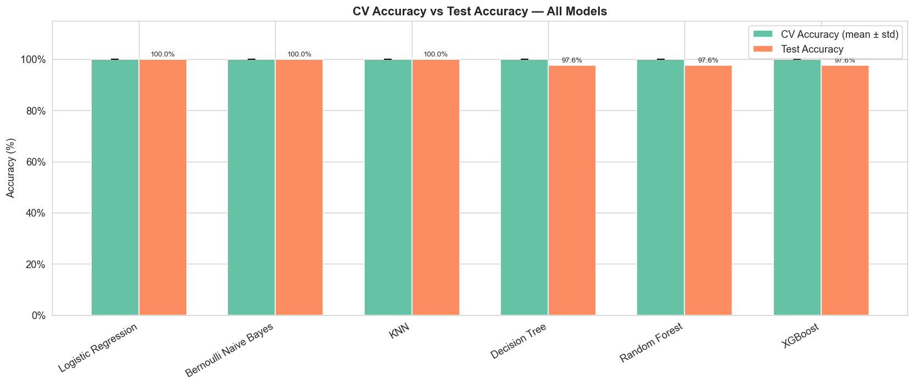
</p>

- CV & Test accuracy across different models is not very different.
- Simpler models perform better than complex models for this dataset.

**F1, Precision, Recall on Test set - All Models**
<p align="center">
  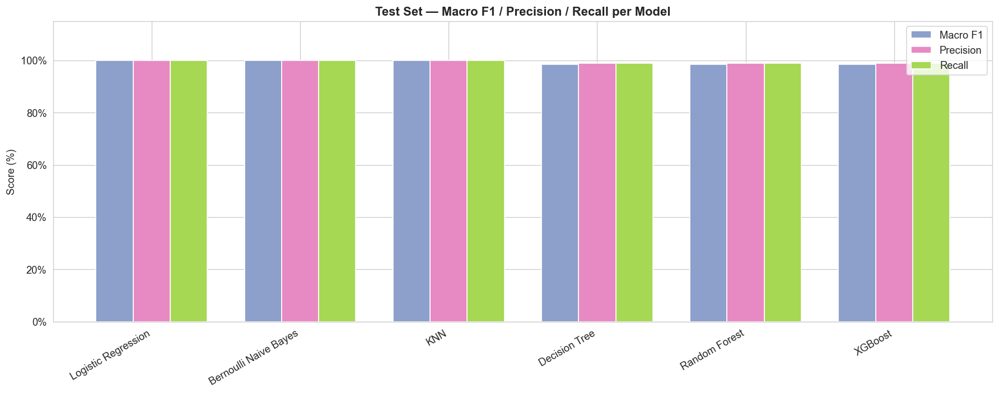
</p>

- All models have nearly identical F1, Precision, Recall on Test set.

**Accuracy vs Training Time - Efficiency tradeoff - All Models**
<p align="center">
  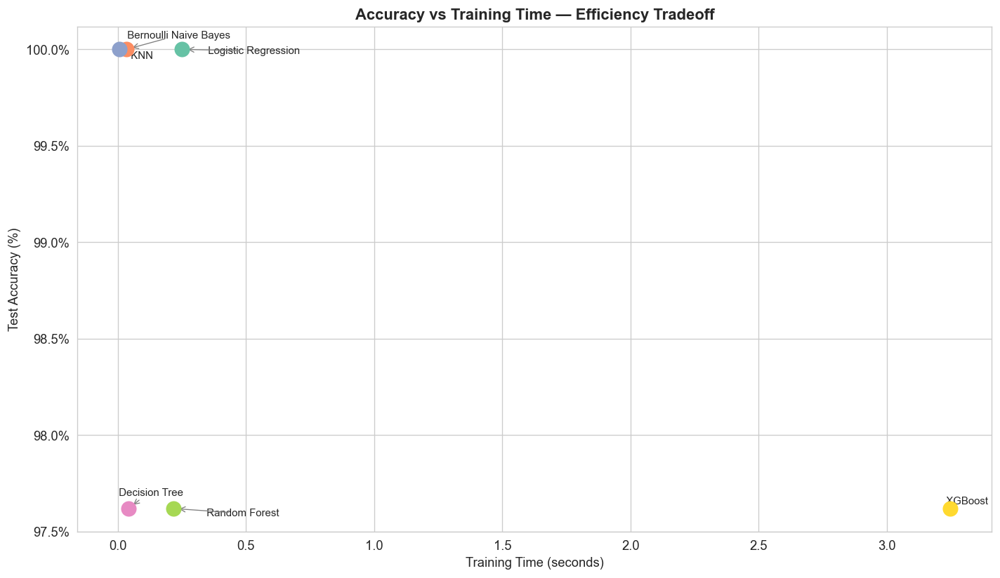
</p>

- Logistic regression, Bernoulli Naive Bayes and KNN: These models are on the top left, implying highest time efficient and accuracy.  
- Decision Tree and Random Forest: These models are on the bottom left corner, implying lower accuracy but time efficient.
- XGBoost: This model is on the far bottom right, implying low time efficiency and model accuracy.

**Multi-Metric Radar Chart - All Models**
<p align="center">
  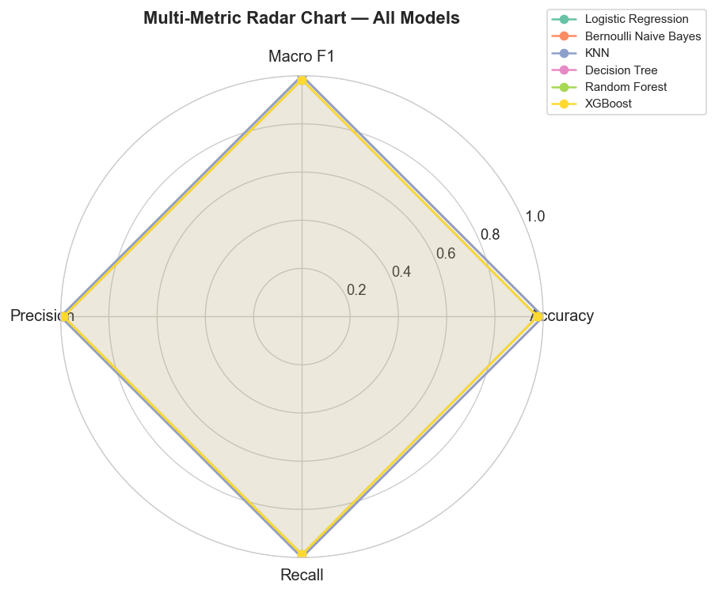
</p>

- The Multi metric polygon nearly overlaps for all the models for this dataset. This implies that all models are comparable in performance.

---
#  Conclusions 
- All six models achieved near-perfect or perfect performance, confirming the **dataset is** highly separable and likely **synthetic rule-based in nature**.
- **Simpler, faster models** (Logistic Regression, Bernoulli Naive Bayes, KNN) matched or **outperformed more complex models** (XGBoost, Random Forest, Decision Tree) — complexity adds no value here.
- XGBoost and Decision Tree were the only models to miss a test case, both misclassifying the same "Fungal infection" record — the most ambiguous symptom profile in the dataset.
- Hierarchical Clustering independently validated the separability finding the 41 natural clusters emerging matching the 41 disease classes without using any labels.
- Results **cannot be generalized** to real clinical settings, model performance would degrade significantly with noisy, incomplete, or atypical real-world patient data.

---
# Future Directions
- Test all models on a real clinical dataset 
- Introduce artificial noise to simulate real-world data quality and measure model robustness
- Extend SHAP analysis to per-disease level to identify the most discriminative symptom for each of the 41 conditions individually
- Explore multi-label classification to handle co-morbidities, where a patient may present with more than one condition simultaneously
- Build a simple interactive symptom checker as a proof-of-concept clinical tool on top of the best interpretable model

---
# Team Videos
- [Aakash Bajaj]()
- [Amena Muzaffar Shumi]()
- [Deeqa Mahamed]()
- [Ecce Djogbenou Epse Houenou]()
- [Emre Ozkan]()
- [Haimeng (James) Wang]()

---
# References
- https://github.com/slathwal/obesity-estimation/blob/main/README.md
- https://github.com/UofT-DSI/git/blob/main/01_materials/git_cheatsheet.md
- https://github.com/UofT-DSI/LCR
- https://github.com/UofT-DSI/algorithms_and_data_structures
- https://github.com/UofT-DSI/deep_learning
