# Emre - KNN vs Random Forest + EDA

This folder has my whole work for this task in one place:
- notebook: `emre-knn-random-forest.ipynb`
- summaries: `eda_summary.json`, `metrics_summary.json`
- plots: `figures/`

I used:
- `data/raw/Training.csv`
- `data/raw/Testing.csv`

Data format quick note:
- 132 symptom columns (binary 0/1)
- target = `prognosis` (text label)
- 41 disease classes

## EDA summary

Main checks:
- missing values
- class balance
- symptoms per record
- symptom prevalence
- symptom correlation
- disease-symptom pattern heatmap

Key findings:
- Missing values: 0 in both train and test
- Class balance: perfectly balanced (120 rows per disease in training)
- Symptoms per record: min 3, max 17, mean 7.45, median 6
- Feature prevalence mean: 0.056 (overall sparse feature space)

EDA plots:
- 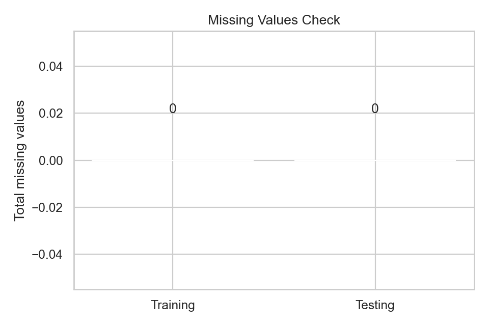
- 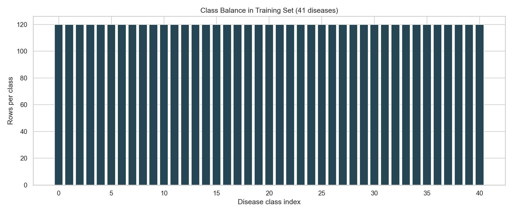
- 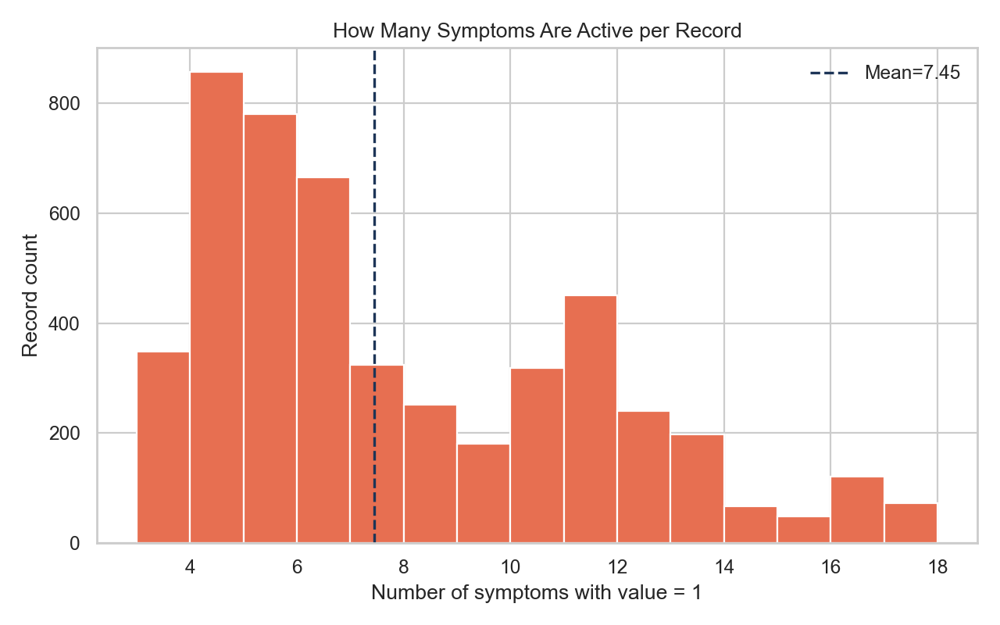
- 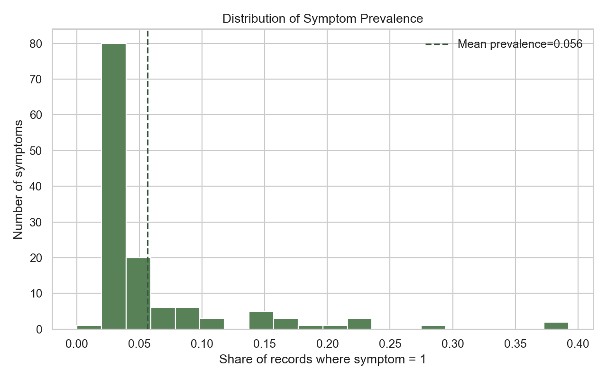
- 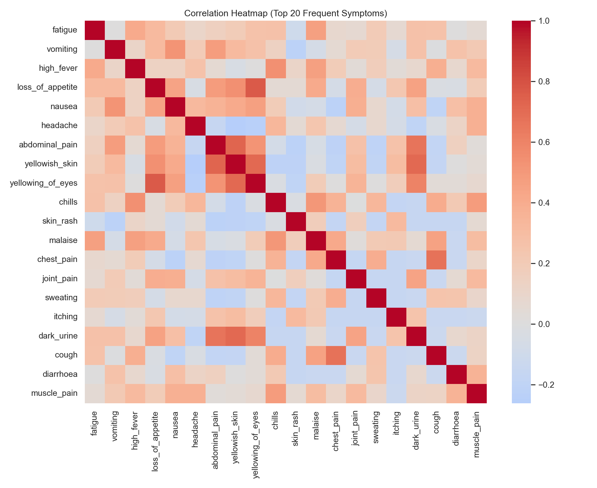
- 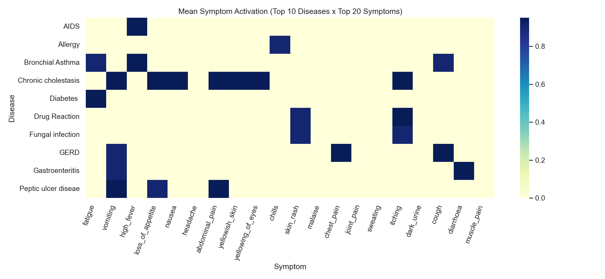
- 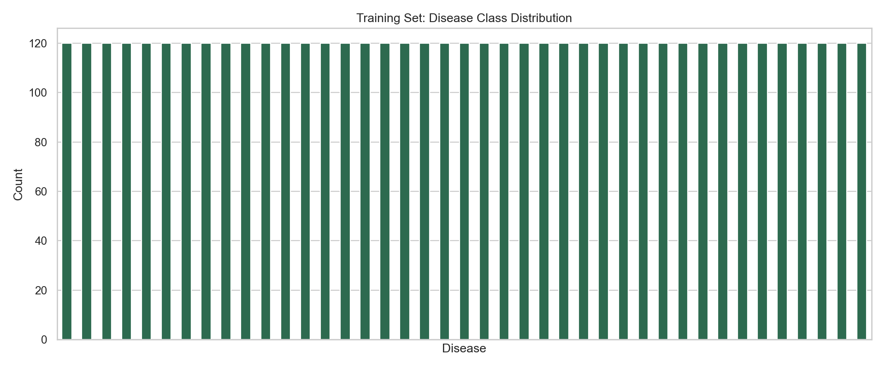
- 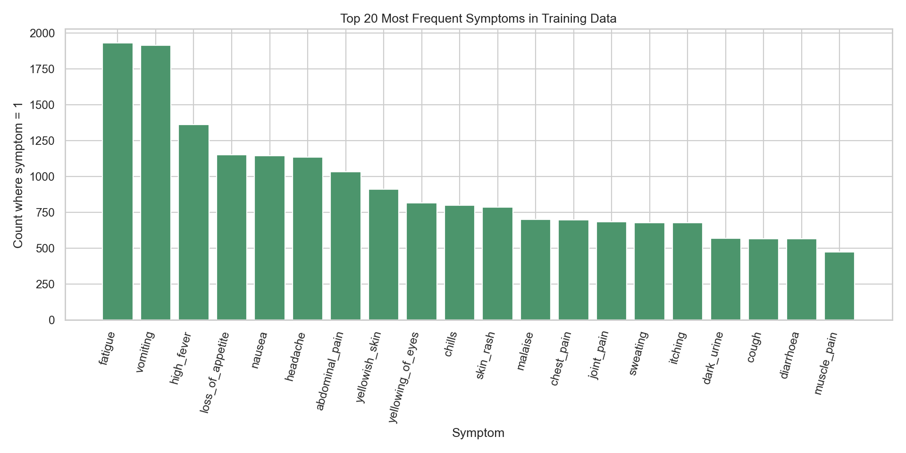

## Model results

Both models are trained separately (standalone), then compared on the same test set.

| Model | Setting | Test Accuracy | Macro F1 |
|---|---|---:|---:|
| KNN | k=1 (best from 5-fold CV) | 1.0000 | 1.0000 |
| Random Forest | n_estimators=500 | 0.9762 | 0.9837 |

Why scores are high:
- dataset is generated and clean
- binary symptom patterns are very structured
- train/test structure is very similar

Model plots:
- 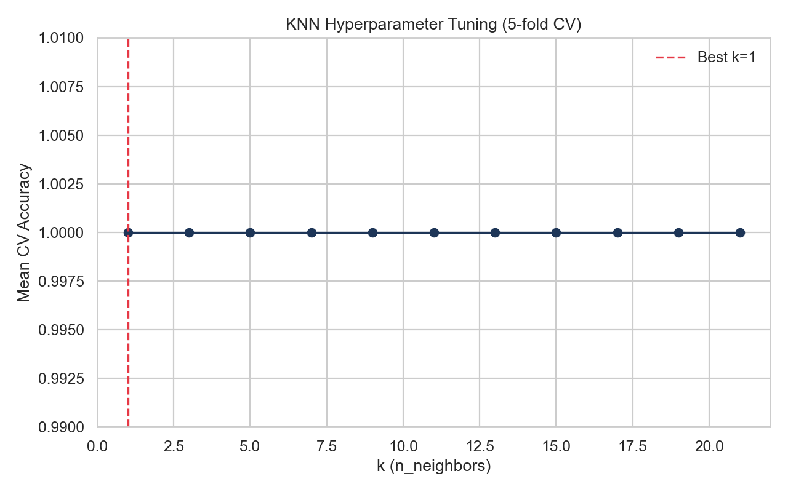
- 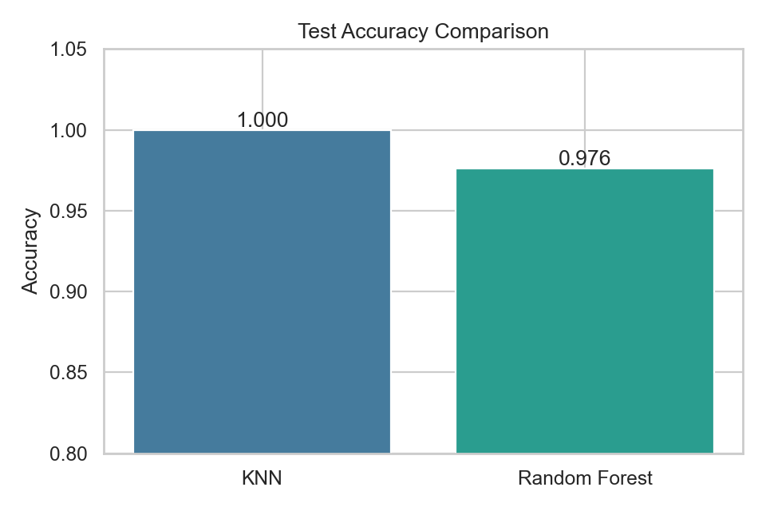
- 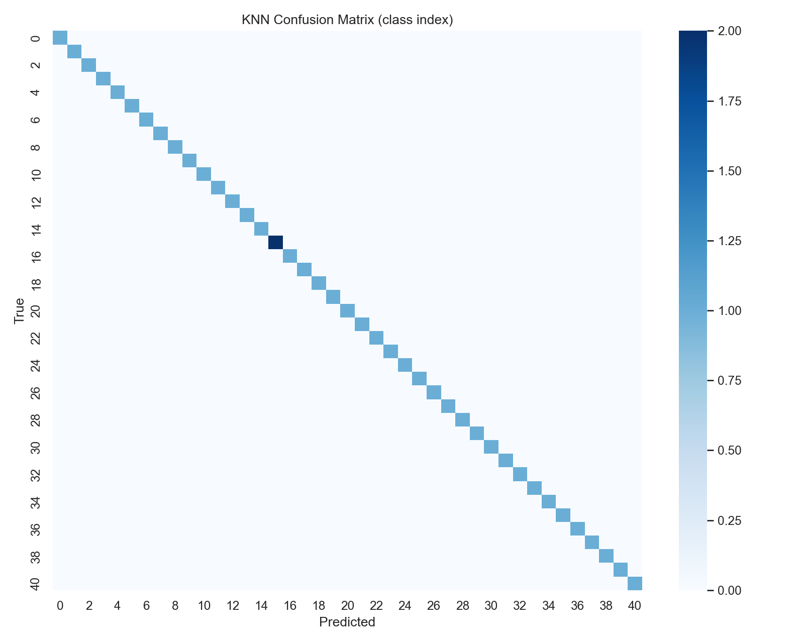
- 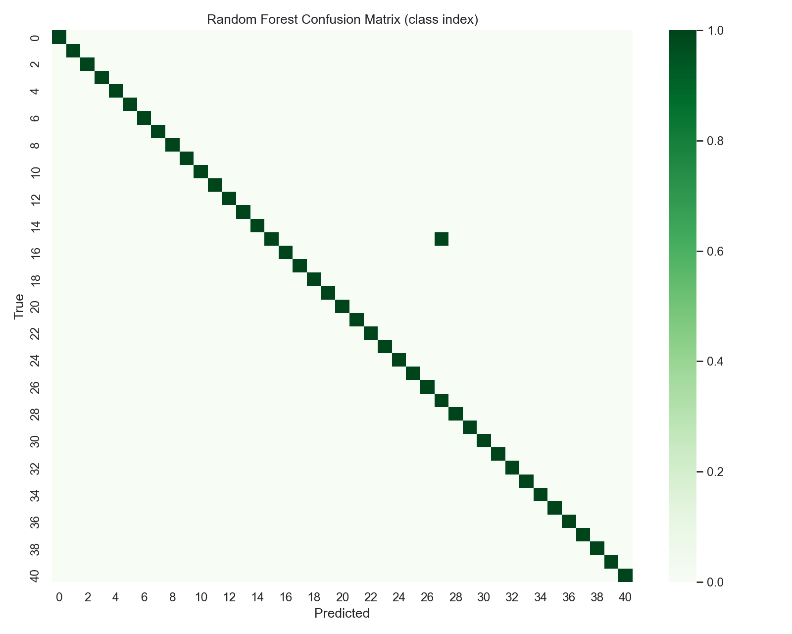
- 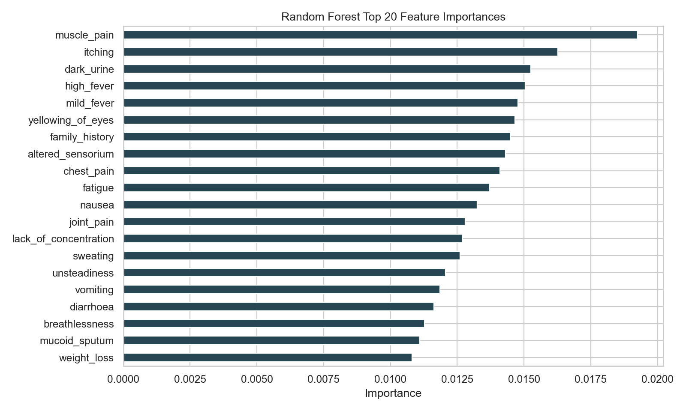

## If I improve this next

1. Use real/noisy patient data to test generalization
2. Tune Random Forest more (`max_depth`, `min_samples_leaf`, etc.)
3. Add top-k diagnosis metrics (top-3)
4. Check probability calibration/confidence quality
